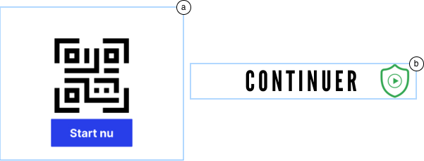
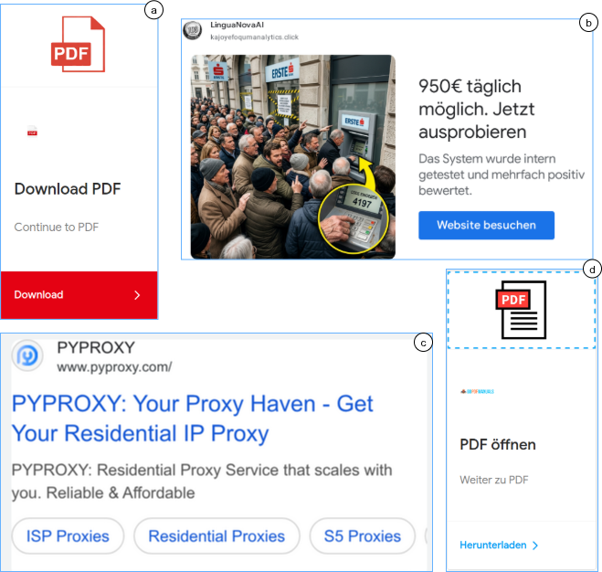
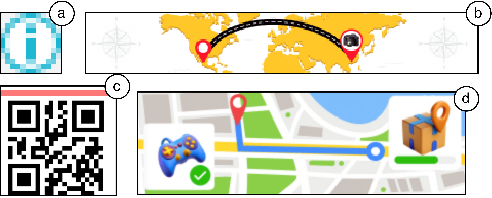
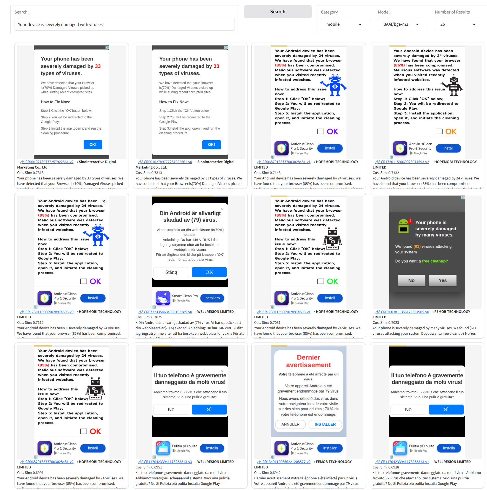

# AdLens — Paper Artifacts

Supplementary material for **"AdLens: Efficient Detection of Deceptive Software Ads"** (CCS 2026).

This page hosts the extended figures, tables, and analyses referenced from the paper's appendix. Each section below is cited from the manuscript.

**Contents**

- [A. Google Ads Policy Violations](#a-google-ads-policy-violations)
- [B. Pipeline Latency Analysis](#b-pipeline-latency-analysis)
- [C. Misleading Ad Design Examples](#c-misleading-ad-design-examples)
- [D. Ads Hosted by PDNS-Flagged Domains](#d-ads-hosted-by-pdns-flagged-domains)
- [E. Misconfigured Ads](#e-misconfigured-ads)
- [F. Semantic Similarity Search Tool](#f-semantic-similarity-search-tool)

---

## A. Google Ads Policy Violations

Google Ads policy violations applicable to software advertisements, organized by category and policy theme. Themes marked with an asterisk (\*) can be evaluated from ad creatives or landing page URLs, and are therefore the basis for the deceptive-category taxonomy used in the paper (§ *Deceptive Ad Categories*).

### Misrepresentation ([policy](https://support.google.com/adspolicy/answer/6020955))

| Policy Theme | Violation Description |
| --- | --- |
| **Clickbait Tactics\*** | Sensationalist phrases (e.g., "You won't believe", "Click here to find out") used to withhold context and bait clicks. |
| | Exploiting negative life events (death, illness, arrest) to induce fear or urgency. |
| | Before-and-after imagery implying significant bodily or system alterations. |
| **Misleading Ad Design\*** | Fake UI elements (buttons, input fields, progress bars) that mislead users into interacting. |
| | Ads mimicking OS notifications, system dialogs, or security alerts. |
| | Visual inconsistencies between the ad and the actual app or landing page. |
| **Unreliable Claims\*** | Improbable outcome claims presented as likely (e.g., guaranteed speed-up, complete virus removal). |
| | Advertising features or offers not present or easily found at the destination. |
| **Identity & Pricing Deception\*** | Impersonating a brand, app, or government entity; using an inaccurate or ambiguous business name. |
| | Undisclosed fees or post-purchase costs; false impression of free access. |

### Malicious & Unwanted Software ([malicious](https://support.google.com/adspolicy/answer/6020954), [unwanted](https://support.google.com/adspolicy/answer/9142124))

| Policy Theme | Violation Description |
| --- | --- |
| **Malware Distribution\*** | Delivering viruses, ransomware, spyware, keyloggers, or trojans via ads or landing pages. |
| | Forced redirects to malware-infected sites without user interaction. |
| | HTML5 ads harvesting user credentials from the publisher's page. |
| **Deceptive Installation** | Piggybacking on another installer or bundling undisclosed components. |
| | Failing to disclose browser or system changes made during installation. |
| | Hiding opt-out options for bundled components in obscured or minimal UI. |
| **Data Collection Without Consent** | Collecting or transmitting user data (contacts, location, files) without disclosure or agreement. |
| | Injecting ads or displaying content outside the app context without informed consent. |

### App Ad Requirements ([policy](https://support.google.com/adspolicy/answer/6368661))

| Policy Theme | Violation Description |
| --- | --- |
| **Ad Interaction Rules** | App name must be displayed clearly throughout the ad; unidentified businesses are prohibited. |
| | Ad must be closeable within 5 seconds; install buttons must not appear suddenly to trigger accidental clicks. |
| **Sign-in Barriers** | Apps must not re-prompt sign-in or activation during ad interactions after initial setup. |
| **Destination Integrity** | Ad content must accurately reflect the app; prerequisite apps must be disclosed and policy-compliant. |

### Enabling Dishonest Behaviour ([policy](https://support.google.com/adspolicy/answer/6016481))

| Policy Theme | Violation Description |
| --- | --- |
| **Unauthorised System Access** | Hacking tools, cheat software, or exploits enabling unauthorized access to systems or devices. |
| | Apps facilitating communication interception (e.g., wiretapping, call monitoring). |
| **Covert Surveillance** | Stalkerware monitoring texts, calls, or browsing history without the target's consent. |
| | GPS trackers marketed explicitly for covert monitoring of another person. |
| **Fake Activity & Dishonest Tools** | Generating invalid clicks, fake reviews, or fraudulent social media endorsements. |
| | Tools enabling academic dishonesty or creation of falsified identity documents. |

### Coordinated Deception ([policy](https://support.google.com/adspolicy/answer/12142035))

| Policy Theme | Violation Description |
| --- | --- |
| **Identity Concealment** | Concealing advertiser identity, country of origin, or affiliations in campaigns relating to matters of public concern. |

---

## B. Pipeline Latency Analysis

Per-stage latency measured over 300 ads on a **single GPU, single-threaded, with no parallelism**. The VLM judge is invoked only on classifier disagreements, so realistic end-to-end (E2E) latency weights judge latency by the observed disagreement rate.

| Stage | Model | p50 (ms) | p95 (ms) |
| --- | --- | ---: | ---: |
| OCR | PaddleOCRv5 | 109 | 217 |
| Translation | `translategemma:4b` | 609 | 1,044 |
| Classify | `gemma3:12b` | 1,246 | 1,596 |
| Classify | `qwen3.5:9b` | 1,762 | 2,336 |
| Judge † | `gemma4:26b` | 6,497 | 9,571 |
| **E2E (no judge)** | | **3,726** | **5,193** |
| **E2E (15% disagreement)** | | **4,700** | **6,629** |
| **E2E (30% disagreement)** | | **5,675** | **8,064** |

† Invoked only on classifier disagreement.

Despite this deliberately conservative setup, the pipeline completes in **4.7 seconds at median** under the 15% disagreement rate observed on the golden dataset, and stays under **6 seconds** even at the 30% rate observed on the crawled dataset — well within the asynchronous review windows typical of ad moderation systems. The 26B VLM judge, though slower at 6.5 s median, contributes under 1 second to the average cost because it fires only on disagreements.

Parallelising the two classify calls would cut classification time by **42%**, bringing realistic end-to-end latency under 3 seconds. Further gains are available through continuous batching, judge quantisation, and speculative decoding, making sub-second per-stage latency feasible on the same hardware without architectural changes.

Raw per-call timings are emitted by the detection pipeline to `detection/results/pipeline_results/latency_calls.json`.

---

## C. Misleading Ad Design Examples

Ads classified under **Misleading Ad Design** that carry no advertiser information. These use low-information call-to-action interfaces while obscuring advertiser identity.



Notes on the examples above:

- **(a)** Dutch — *"Start Nu"* ("Start Now"), shown alongside an undecodable QR code. This was the most-viewed ad in the category at **2.1M impressions**, linking to an unknown sports streaming subscription service (`megastore-online.co`). The creative contained no information about the promoted product or service.
- **(b)** French — *"Continuer"* ("Continue"), next to a green shield icon. Shown only in France, it received **1.6M impressions**. Crawl metadata showed the ad opens `govulo.com`, for which multiple Trustpilot reviewers reported being misled by deceptive ads and pop-ups impersonating other services, leading them to unknowingly enter payment details and sign up for a paid subscription.

---

## D. Ads Hosted by PDNS-Flagged Domains

A sample of ads available on the Google Ad Transparency Center linking to malicious domains detected by **multiple** Protective DNS providers.



Two of these ads — **(a)** and **(c)** — were taken down by Google after we reported them for linking to malicious domains. Takedown reports for **(b)** and **(d)** were still being processed at the time of submission.

---

## E. Misconfigured Ads

Beyond the three violation categories analysed in the paper, we identified a fourth class of **misconfigured ads** in the dataset.



These are ads where either the creative is filled with garbled text, or the creative does not exist on the platform at all — often replaced with a white box or a bare AdChoices icon. Although benign, this class reflects a gap in Google's implementation of the transparency platform and should be checked for robustness.

---

## F. Semantic Similarity Search Tool

The web-based semantic similarity search interface, which retrieves similar ads from the embedding space using free-text queries.



The tool lets researchers and policymakers explore the ad corpus without re-running the full pipeline. See [`search_platform/`](search_platform/) for the implementation and instructions to render the search tool locally over the sample images in [`sample_data/`](sample_data/).

---

## Citing

If you use these artifacts, please cite the paper:

```bibtex
@inproceedings{roongta2026adlens,
  title     = {AdLens: Efficient Detection of Deceptive Software Ads},
  author    = {Roongta, Ritik and Darwish, Marwan Adnan and
               Aghdam, Masoud Poorghaffar and Greenstadt, Rachel and Acar, Gunes},
  booktitle = {Proceedings of the ACM SIGSAC Conference on Computer and
               Communications Security (CCS)},
  year      = {2026}
}
```
