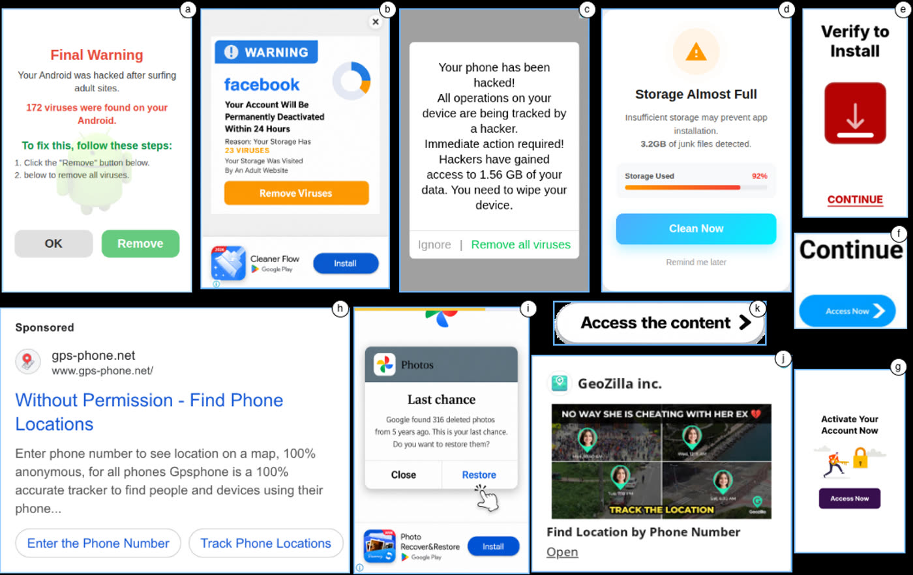

# AdLens — Paper Artifacts

Supplementary material for **"AdLens: Efficient Detection of Deceptive Software Ads"** (CCS 2026).

This page hosts the extended figures, tables, and analyses referenced from the paper's appendix. Each section below is cited from the manuscript.

**Contents**

- [A. Google Ads Policy Violations](#a-google-ads-policy-violations)
- [B. Pipeline Latency Analysis](#b-pipeline-latency-analysis)
- [C. Misleading Ad Design Examples](#c-misleading-ad-design-examples)
- [D. Ads Hosted by PDNS-Flagged Domains](#d-ads-hosted-by-pdns-flagged-domains)
- [E. Misconfigured Ads](#e-misconfigured-ads)
- [F. Semantic Similarity Search Tool](#f-semantic-similarity-search-tool)
- [G. Example Deceptive Ads](#g-example-deceptive-ads)
- [H. Crawled Dataset Overview](#h-crawled-dataset-overview)
- [I. Top Violating Advertisers](#i-top-violating-advertisers)
- [J. Deceptive Ad Taxonomy](#j-deceptive-ad-taxonomy)
- [K. Pipeline Architecture](#k-pipeline-architecture)

---

## A. Google Ads Policy Violations

Google Ads policy violations applicable to software advertisements, organized by category and policy theme. Themes marked with an asterisk (\*) can be evaluated from ad creatives or landing page URLs, and are therefore the basis for the deceptive-category taxonomy used in the paper (§ *Deceptive Ad Categories*).

### Misrepresentation ([policy](https://support.google.com/adspolicy/answer/6020955))

| Policy Theme | Violation Description |
| --- | --- |
| **Clickbait Tactics\*** | Sensationalist phrases (e.g., "You won't believe", "Click here to find out") used to withhold context and bait clicks. |
| | Exploiting negative life events (death, illness, arrest) to induce fear or urgency. |
| | Before-and-after imagery implying significant bodily or system alterations. |
| **Misleading Ad Design\*** | Fake UI elements (buttons, input fields, progress bars) that mislead users into interacting. |
| | Ads mimicking OS notifications, system dialogs, or security alerts. |
| | Visual inconsistencies between the ad and the actual app or landing page. |
| **Unreliable Claims\*** | Improbable outcome claims presented as likely (e.g., guaranteed speed-up, complete virus removal). |
| | Advertising features or offers not present or easily found at the destination. |
| **Identity & Pricing Deception\*** | Impersonating a brand, app, or government entity; using an inaccurate or ambiguous business name. |
| | Undisclosed fees or post-purchase costs; false impression of free access. |

### Malicious & Unwanted Software ([malicious](https://support.google.com/adspolicy/answer/6020954), [unwanted](https://support.google.com/adspolicy/answer/9142124))

| Policy Theme | Violation Description |
| --- | --- |
| **Malware Distribution\*** | Delivering viruses, ransomware, spyware, keyloggers, or trojans via ads or landing pages. |
| | Forced redirects to malware-infected sites without user interaction. |
| | HTML5 ads harvesting user credentials from the publisher's page. |
| **Deceptive Installation** | Piggybacking on another installer or bundling undisclosed components. |
| | Failing to disclose browser or system changes made during installation. |
| | Hiding opt-out options for bundled components in obscured or minimal UI. |
| **Data Collection Without Consent** | Collecting or transmitting user data (contacts, location, files) without disclosure or agreement. |
| | Injecting ads or displaying content outside the app context without informed consent. |

### App Ad Requirements ([policy](https://support.google.com/adspolicy/answer/6368661))

| Policy Theme | Violation Description |
| --- | --- |
| **Ad Interaction Rules** | App name must be displayed clearly throughout the ad; unidentified businesses are prohibited. |
| | Ad must be closeable within 5 seconds; install buttons must not appear suddenly to trigger accidental clicks. |
| **Sign-in Barriers** | Apps must not re-prompt sign-in or activation during ad interactions after initial setup. |
| **Destination Integrity** | Ad content must accurately reflect the app; prerequisite apps must be disclosed and policy-compliant. |

### Enabling Dishonest Behaviour ([policy](https://support.google.com/adspolicy/answer/6016481))

| Policy Theme | Violation Description |
| --- | --- |
| **Unauthorised System Access** | Hacking tools, cheat software, or exploits enabling unauthorized access to systems or devices. |
| | Apps facilitating communication interception (e.g., wiretapping, call monitoring). |
| **Covert Surveillance** | Stalkerware monitoring texts, calls, or browsing history without the target's consent. |
| | GPS trackers marketed explicitly for covert monitoring of another person. |
| **Fake Activity & Dishonest Tools** | Generating invalid clicks, fake reviews, or fraudulent social media endorsements. |
| | Tools enabling academic dishonesty or creation of falsified identity documents. |

### Coordinated Deception ([policy](https://support.google.com/adspolicy/answer/12142035))

| Policy Theme | Violation Description |
| --- | --- |
| **Identity Concealment** | Concealing advertiser identity, country of origin, or affiliations in campaigns relating to matters of public concern. |

---

## B. Pipeline Latency Analysis

Per-stage latency measured over 300 ads on a **single GPU, single-threaded, with no parallelism**. The VLM judge is invoked only on classifier disagreements, so realistic end-to-end (E2E) latency weights judge latency by the observed disagreement rate.

| Stage | Model | p50 (ms) | p95 (ms) |
| --- | --- | ---: | ---: |
| OCR | PaddleOCRv5 | 109 | 217 |
| Translation | `translategemma:4b` | 609 | 1,044 |
| Classify | `gemma3:12b` | 1,246 | 1,596 |
| Classify | `qwen3.5:9b` | 1,762 | 2,336 |
| Judge † | `gemma4:26b` | 6,497 | 9,571 |
| **E2E (no judge)** | | **3,726** | **5,193** |
| **E2E (15% disagreement)** | | **4,700** | **6,629** |
| **E2E (30% disagreement)** | | **5,675** | **8,064** |

† Invoked only on classifier disagreement.

Despite this deliberately conservative setup, the pipeline completes in **4.7 seconds at median** under the 15% disagreement rate observed on the golden dataset, and stays under **6 seconds** even at the 30% rate observed on the crawled dataset — well within the asynchronous review windows typical of ad moderation systems. The 26B VLM judge, though slower at 6.5 s median, contributes under 1 second to the average cost because it fires only on disagreements.

Parallelising the two classify calls would cut classification time by **42%**, bringing realistic end-to-end latency under 3 seconds. Further gains are available through continuous batching, judge quantisation, and speculative decoding, making sub-second per-stage latency feasible on the same hardware without architectural changes.

Raw per-call timings are emitted by the detection pipeline to `detection/results/pipeline_results/latency_calls.json`.

---

## C. Misleading Ad Design Examples

Ads classified under **Misleading Ad Design** that carry no advertiser information. These use low-information call-to-action interfaces while obscuring advertiser identity.


Notes on the examples above:

- **(a)** Dutch — *"Start Nu"* ("Start Now"), shown alongside an undecodable QR code. This was the most-viewed ad in the category at **2.1M impressions**, linking to an unknown sports streaming subscription service (`megastore-online.co`). The creative contained no information about the promoted product or service.
- **(b)** French — *"Continuer"* ("Continue"), next to a green shield icon. Shown only in France, it received **1.6M impressions**. Crawl metadata showed the ad opens `govulo.com`, for which multiple Trustpilot reviewers reported being misled by deceptive ads and pop-ups impersonating other services, leading them to unknowingly enter payment details and sign up for a paid subscription.

---

## D. Ads Hosted by PDNS-Flagged Domains

A sample of ads available on the Google Ad Transparency Center linking to malicious domains detected by **multiple** Protective DNS providers.

Landing-page hostnames were extracted from ad HTML and OCR text, then queried against four Protective DNS providers (Cloudflare, Cisco Umbrella, Quad9, CIRA). Only domains flagged by two or more providers are listed. CIRA verdicts are annotated MW (malware) or PH (phishing).

| Domain | Linking Ads | Tranco Rank | Blocking PDNS |
| --- | ---: | ---: | --- |
| `spolecz[...].convertri.com` | ~3K | 59K | CIRA (MW), CF, Quad9 |
| `dropland.net` | 0 | 950K | CIRA (PH), CF |
| `keysoft.store` | 18 | 1.6M | CIRA (PH), CF |
| `licenzegenius.it` | 9 | 1.6M | CIRA (PH), CF |
| `nerdused.com` | 62 | 1.6M | CIRA (PH), CF |
| `eu.yourfavouritedocs.com` | ~900 | 1.6M | CIRA (MW), CF |
| `pyproxy.com` | 1 | 2.6M | CIRA (MW), Quad9 |
| `gopdfmanuals.com` | ~300 | 3.2M | CIRA (MW), CF |
| `kajoyefoqumanalytics.click` | 1 | 3.2M | CIRA (MW), CF |
| `pdfscraper.com` | 42 | 3.2M | CIRA (MW), CF |
| `pl.getniy.shop` | 0 | 3.2M | CIRA (PH), CF |


Two of these ads — **(a)** and **(c)** — were taken down by Google after we reported them for linking to malicious domains. Takedown reports for **(b)** and **(d)** were still being processed at the time of submission.

---

## E. Misconfigured Ads

Beyond the three violation categories analysed in the paper, we identified a fourth class of **misconfigured ads** in the dataset.


These are ads where either the creative is filled with garbled text, or the creative does not exist on the platform at all — often replaced with a white box or a bare AdChoices icon. Although benign, this class reflects a gap in Google's implementation of the transparency platform and should be checked for robustness.

---

## F. Semantic Similarity Search Tool

The web-based semantic similarity search interface, which retrieves similar ads from the embedding space using free-text queries.


The tool lets researchers and policymakers explore the ad corpus without re-running the full pipeline. See [`search_platform/`](search_platform/) for the implementation and instructions to render the search tool locally over the sample images in [`sample_data/`](sample_data/).

---

## G. Example Deceptive Ads

Representative creatives identified by AdLens across all three violation categories. Every one of these was live and reachable through the public Google Ads Transparency Center at the time of the crawl.



- **(a–d) Scareware** — fake virus, hack, and storage warnings, typically imitating an operating-system dialog.
- **(e, f, g, k) Misleading Ad Design** — low-information call-to-action buttons carrying no advertiser identity.
- **(h, i, j) Deceptive Claims** — plausible but false capabilities, such as locating a person from a phone number or recovering photos deleted years earlier.

---

## H. Crawled Dataset Overview

188,834 ad creatives collected across the Software, Mobile App Utilities, and Computer & Consumer Electronics categories (112,761 remain after exact OCR-text deduplication). The software category is covered near-exhaustively; mobile and computer are sampled from much larger populations (~303K and ~6.5M ad IDs respectively).

| Metric | Computer | Mobile | Software | Total |
| --- | ---: | ---: | ---: | ---: |
| Total creatives | 54,211 | 61,191 | 73,432 | **188,834** |
| Dedup. creatives | 35,467 | 36,217 | 41,077 | **112,761** |
| Ad type — Image | 16,527 | 16,558 | 41,077 | 74,162 |
| Ad type — Text | 7,800 | 9,423 | 0 | 17,223 |
| Ad type — Video | 11,140 | 10,236 | 0 | 21,376 |

---

## I. Top Violating Advertisers

Top three advertisers per violation category, ranked by violating ad count. Two of the three most prolific scareware advertisers each exceed a billion total ad impressions.

### Scareware

| Advertiser | Loc. | Violating Ads | Violating Impr. | Total Impr. | Regions | Days |
| --- | --- | ---: | ---: | ---: | ---: | ---: |
| WELLRESION LIMITED | HK | 90 | 10.96M | 1.22B | 8 | 617 |
| FEMOB TECHNOLOGY LIMITED | HK | 17 | 153.00K | 44.32M | 7 | 265 |
| Tripsoft Global Ltd. | VG | 10 | 174.50K | 5.96B | 4 | 340 |

### Deceptive Claims

| Advertiser | Loc. | Violating Ads | Violating Impr. | Total Impr. | Regions | Days |
| --- | --- | ---: | ---: | ---: | ---: | ---: |
| GeoZilla Inc | US | 771 | 2.68M | 204.83M | 8 | 462 |
| Family Locator, LLC | US | 660 | 1.67M | 60.61M | 7 | 468 |
| APPLYFT LTD | CY | 351 | 428.50K | 35.20M | 6 | 202 |

### Misleading Ad Design

| Advertiser | Loc. | Violating Ads | Violating Impr. | Total Impr. | Regions | Days |
| --- | --- | ---: | ---: | ---: | ---: | ---: |
| ZODIAC TECHNOLOGIES DMCC | AE | 169 | 8.47M | 2.30B | 1 | 397 |
| Antelaria Limited | CY | 17 | 5.00K | 392.97M | 1 | 165 |
| Mobitrans FZ LLC | AE | 12 | 1.50K | 598.20M | 1 | 91 |

---

## J. Deceptive Ad Taxonomy

Reference statements per theme, derived from manual annotation of ~5,000 ads plus the Google ad policies in [§ A](#a-google-ads-policy-violations). For scareware and deceptive claims these statements seed the semantic-similarity ranking stage: an ad is prioritised for classification when its translated text sits close to one of them in embedding space.

### Scareware

| Theme | Reference Statements |
| --- | --- |
| **Account Deactivation / Suspension** | Last warning: Your account will be suspended or restricted. |
| | Your account will be permanently disabled because it does not comply with our rules. |
| | Your account has been flagged for unusual login attempts. Verify immediately or lose access. |
| | Action required: Your account will be deleted within 24 hours unless you confirm your identity. |
| **Storage & Device Performance** | Your device storage is full. |
| | Your phone is running slow because of junk files. |
| | Your software/pdf version is outdated. |
| | Your battery is draining fast because of background apps. |
| **Virus / Malware Infection** | Your phone is infected with viruses. |
| | Your device is severely compromised because you visited adult websites. |
| | Your browser is damaged by Trojan horses downloaded while visiting illegal websites. |
| | Warning: 13 viruses have been detected on your device. Clean now. |
| | Your phone has been compromised by spyware. Your camera and microphone may be recording. |
| **Hacker / Data Breach** | Your device has been hacked and your personal information is at risk. |
| | Someone is monitoring your browsing activity right now. |
| | Your passwords have been exposed in a data breach. Change them immediately. |
| **Legal / Law Enforcement** | Your IP address has been flagged for illegal activity. |
| | Law enforcement has been notified about suspicious activity from your device. |
| **Privacy Exposure** | Your personal photos are visible to everyone on the internet. |
| | Your location is being tracked. Disable tracking immediately. |
| | Your browsing history is publicly accessible. Hide it now. |

### Deceptive Claims

| Theme | Reference Statements |
| --- | --- |
| **Photo / Data Recovery Bait** | You deleted 100 photos 3 years ago. Recover them. |
| | Photos deleted 4 years ago were found in memory. Recover them now. |
| | We found 347 recoverable files on your device. Restore them. |
| **People Tracking / Surveillance** | Track anyone's location by entering their phone number. |
| | Find out who is calling you from unknown numbers. |
| | Monitor your partner's private messages and location. |
| | Track spirits or spells around you. |
| **Social Curiosity Bait** | Install this app to find out who secretly hates you. |
| | Install this app to find out who has a secret crush on you. |
| | Find out what your friends really think about you. |

### Misleading Ad Design

| Theme | Reference Statements |
| --- | --- |
| **Call to Action Baits** | Access Now, Continue, Click here, etc. |

---

## K. Pipeline Architecture

The end-to-end system: crawl the Ads Transparency Center, extract text from each creative, translate it, rank it against the violation categories in [§ J](#j-deceptive-ad-taxonomy), then classify the top of that ranking with a multi-VLM ensemble and a judge for disagreements.


The lower boxes show how the violation taxonomy is derived (Google policies + manual analysis) and where the semantic-similarity rank and multi-VLM vote sit relative to the VLM judge.

---

## Citing

If you use these artifacts, please cite the paper:

```bibtex
@inproceedings{roongta2026adlens,
  title     = {AdLens: Efficient Detection of Deceptive Software Ads},
  author    = {Roongta, Ritik and Darwish, Marwan Adnan and
               Aghdam, Masoud Poorghaffar and Greenstadt, Rachel and Acar, Gunes},
  booktitle = {Proceedings of the ACM SIGSAC Conference on Computer and
               Communications Security (CCS)},
  year      = {2026}
}
```
