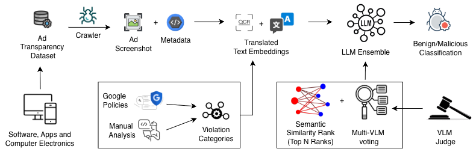

# AdLens — CCS 2026 Cycle B



**Figure 1:** A high-level diagram illustrating AdLens architecture: Ad Collection and Ad analysis pipeline. We collect software ads and classify them as malicious/benign through this automated pipeline. Translated text embeddings step takes both ad text and taxonomy as input and outputs their embeddings to the LLM ensemble step for semantic ranking, followed by multi-VLM voting and Judge verification.

A measurement and detection system for malvertising and deceptive ad practices on the **Google Ad Transparency Center**. AdLens crawls ad creatives at scale, extracts text via OCR, and classifies ads into violation categories using an ensemble of vision-language models.

## Erratum — Table 2 (Section 5)

In the submission manuscript, the per-class scores for **Deceptive Claims** and **Scareware** in section **(c) Full Pipeline — Test Set** were inadvertently transposed when copying results from the script output into the paper. The values in [`scripts/f1_score_table2.py`](scripts/f1_score_table2.py) are correct. This will be corrected in the final version.

This error affects only the column-level P/R/F1 breakdown for those two classes in the temporal-robustness evaluation. The Macro F1 scores are unaffected because they are the unweighted average of all three per-class F1 values, which remains the same regardless of column order. Importantly, the transposition does not alter the core finding: performance does not degrade on the held-out test set but in fact improves relative to the golden set evaluation, confirming the temporal robustness of the pipeline.

Where values differ: ~~published~~ → **corrected**.

*DC = Deceptive Claims · SW = Scareware · MD = Misleading Design*

### (a) Ensemble Classifiers — Golden Set (1,283 items)

| Model | DC P | DC R | DC F1 | SW P | SW R | SW F1 | MD P | MD R | MD F1 | Macro F1 |
|---|---|---|---|---|---|---|---|---|---|---|
| Qwen3.5:9b | 0.973 | 0.787 | 0.870 | 0.989 | 0.949 | 0.969 | 0.859 | 0.970 | 0.911 | 0.917 |
| Gemma3:12b | 0.873 | 0.822 | 0.847 | 0.994 | 0.803 | 0.888 | 0.966 | 0.586 | 0.729 | 0.821 |
| GLM-4.6V-Flash:9b | 0.994 | 0.791 | 0.881 | 0.930 | 1.000 | 0.964 | 0.963 | 0.109 | 0.195 | 0.680 |

### (b) Judge Models — Golden Set, Disagreement Cases Only

| Model | DC P | DC R | DC F1 | SW P | SW R | SW F1 | MD P | MD R | MD F1 | Macro F1 |
|---|---|---|---|---|---|---|---|---|---|---|
| Gemma4:26b | 0.897 | 0.929 | 0.912 | 0.967 | 0.935 | 0.951 | 0.861 | 0.946 | 0.902 | 0.922 |
| Qwen3.5:27b | 0.628 | 0.964 | 0.761 | 0.939 | 1.000 | 0.969 | 0.861 | 0.946 | 0.902 | 0.877 |
| Mistral-small3.2:24b | 0.800 | 0.714 | 0.755 | 0.968 | 0.968 | 0.968 | 0.897 | 0.848 | 0.872 | 0.865 |

### (c) Full Pipeline — Test Set

| Model | DC P | DC R | DC F1 | SW P | SW R | SW F1 | MD P | MD R | MD F1 | Macro F1 |
|---|---|---|---|---|---|---|---|---|---|---|
| Qwen3.5:9b | ~~1.000~~ **0.978** | ~~0.958~~ **0.880** | ~~0.979~~ **0.926** | ~~0.978~~ **1.000** | ~~0.880~~ **0.958** | ~~0.926~~ **0.979** | 1.000 | 1.000 | 1.000 | 0.968 |
| Gemma3:12b | ~~0.978~~ **0.873** | ~~0.938~~ **0.960** | ~~0.957~~ **0.914** | ~~0.873~~ **0.978** | ~~0.960~~ **0.938** | ~~0.914~~ **0.957** | 1.000 | 1.000 | 1.000 | 0.957 |
| Gemma4:26b (judge) | ~~0.980~~ **1.000** | 1.000 | ~~0.990~~ **1.000** | ~~1.000~~ **0.980** | 1.000 | ~~1.000~~ **0.990** | 1.000 | 1.000 | 1.000 | **0.997** |

## Requirements

- **Python 3.12** (most stable tested version)
- **Node.js 18+** (crawler only)
- **Ollama** with models pulled locally (detection pipeline)
- **CUDA-capable GPU** (OCR and VLM inference)
- **Google Cloud credentials** (BigQuery queries)

Install Python dependencies:

```bash
pip install -r requirements.txt
```

Install crawler dependencies:

```bash
cd crawler && npm install
```

## End-to-End Pipeline

### Step 1 — Crawl

Collect ad creatives and screenshots from `adstransparency.google.com` for a given advertiser:

```bash
cd crawler
python run.py <ad-csv-file> --workers 2
```

See [`crawler/README.md`](crawler/README.md) for authenticated crawling and bulk URL input.

### Step 2 — OCR

Extract text from the downloaded screenshots using PaddleOCR PP-OCRv5:

```bash
cd ocr
python process.py \
    --images-dir ../crawler/results/screenshots/worker_0 \
    --output-file ocr.json \
    --device cpu
```

See [`ocr/README.md`](ocr/README.md) for GPU/CPU options and batching flags.

### Step 3 — Translate

Translate non-English OCR text to English using `translategemma:4b` via Ollama. Pass `--out` pointing back at `metadata.json` so the pipeline in Step 4 picks up the translations:

```bash
ollama pull translategemma:4b

python detection/translate_ocr.py \
    --metadata sample_data/metadata.json \
    --out      sample_data/metadata.json
# Reads  : sample_data/metadata.json  (needs ocr_text per record)
# Writes : sample_data/metadata.json  (adds translated_ocr_text in-place)
#          sample_data/cached_translations.json  (dedup translation cache)
```

### Step 4 — Detect

Classify ads with a two-model ensemble (qwen3.5:9b + gemma3:12b) and resolve disagreements with a judge (gemma4:26b).

**Input:** `sample_data/metadata.json` — labeled records with fields `ad_id`, `violation_type`, `label`, `ocr_text` (and `translated_ocr_text` if Step 3 was run). Images are resolved as `sample_data/images/<ad_id>.png`.

```bash
ollama pull qwen3.5:9b
ollama pull gemma3:12b
ollama pull gemma4:26b

python detection/adlens_pipeline.py
# Output: detection/results/pipeline_results/
#   scareware_results.json
#   misleading_results.json   (deceptive_claim)
#   ad_design_results.json    (misleading_design)
#   classify_cache.json       (resumable)
#   latency_calls.json
```

Run specific violations or cap records for a quick test:

```bash
python detection/adlens_pipeline.py --violations scareware --limit 50
```

## End-to-End Run (single script)

`run_all.py` chains all four stages in one command and produces a single consolidated JSON. Works on a CSV of ads or a single image.

**Before running**, install the parent dependencies and the OCR-specific dependencies (CPU by default):

```bash
pip install -r requirements.txt
pip install -r ocr/requirements.txt
```

> **GPU note:** `ocr/requirements.txt` installs `paddlepaddle` (CPU) by default. For GPU inference, open `ocr/requirements.txt`, comment out `paddlepaddle`, and uncomment the `paddlepaddle-gpu` lines before running the command above. **Do not have both `paddlepaddle` and `paddlepaddle-gpu` installed at the same time — it causes crashes.**

```bash
# Classify a single ad image
python run_all.py --image path/to/ad.png

# Crawl + classify from a CSV
python run_all.py --csv ads.csv --workers 2 --device gpu:0
```

Each stage saves an intermediate file (`ads_after_ocr.json`, `ads_after_translate.json`). Use `--skip-crawl`, `--skip-ocr`, or `--skip-translate` to resume from any stage. Output is written to `run_all_output/ads_final.json` by default (override with `--out-dir`).

The final JSON contains one record per ad with all fields merged: crawler metadata, per-variant OCR text and translation, per-violation classification (per-model, ensemble, judge), and a top-level `malicious` flag.


## Repository Layout

```
.
├── run_all.py        # End-to-end pipeline: crawl → OCR → translate → detect
├── crawler/          # Puppeteer crawler for Google Ad Transparency Center
├── detection/        # Ensemble VLM classification pipeline
│   ├── adlens_pipeline.py    # main entry point (steps 3–4)
│   ├── ensemble.py           # classifier prompts + standalone runner; evaluates all three tested models, selects 2
│   ├── misleading_design.py  # CTA/undisclosed-advertiser detection
│   ├── llm_judge.py          # disagreement judge; evaluates three candidate judge models
│   ├── translate_ocr.py      # step 3 — OCR translation
│   └── detect_misconfigured.py  # standalone utility (not part of the pipeline)
├── ocr/              # PaddleOCR text extraction pipeline
├── sample_data/      # Labeled ad dataset (images + metadata)
├── scripts/          # Utility and analysis scripts
│   ├── f1_score_table2.py    # Table 2 reproduction (P/R/F1 per model × violation)
│   ├── pdns/                 # Passive DNS lookups for ad landing domains
│   └── plots/                # Paper figure scripts (bar chart, precision bins, dedup)
├── search_platform/  # Gradio semantic search UI
├── sql_queries/      # BigQuery SQL queries and Python client
├── utils/            # Shared Python utilities
└── datasets/         # Golden evaluation sets and confirmed-violation examples
```
